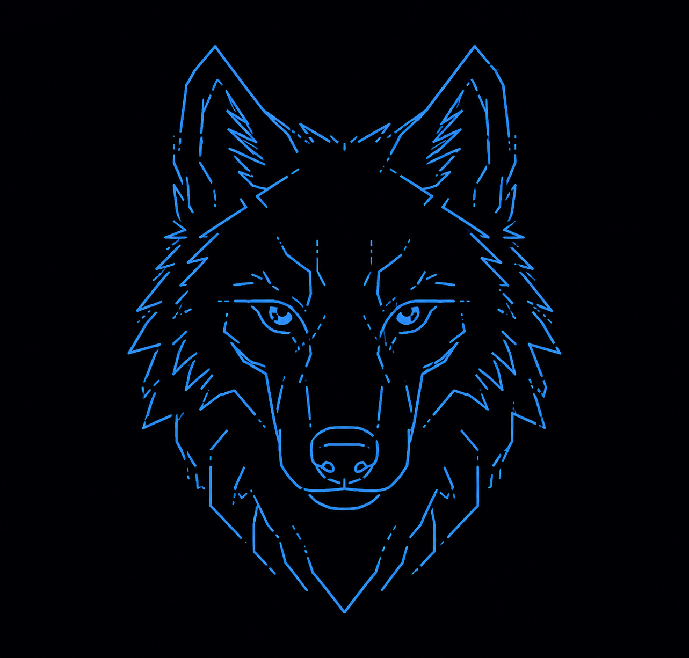
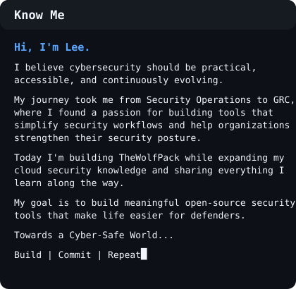
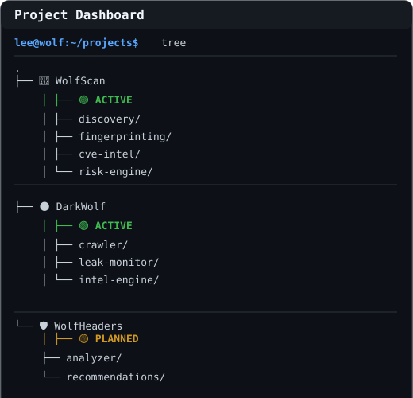
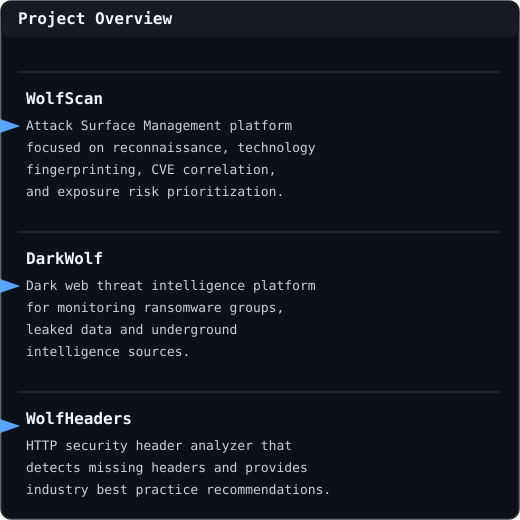

  

### Cybersecurity • GRC • Security Automation

Building cybersecurity tools and learning in public.

 

## About Me

<table>
<tr>

<td valign="top" width="52%">

</td>

<td width="20"></td>

<td valign="top" width="48%">

</td>

</tr>
</table>

## Projects

<table>
<tr>

<td valign="top" width="52%">

</td>

<td width="8"></td>

<td  width="48%">

</td>

</tr>
</table>

##  Tech Stack

## Contribution Graph

## Play a Little

## Connect

### 🐺 Build • Hunt • Learn

